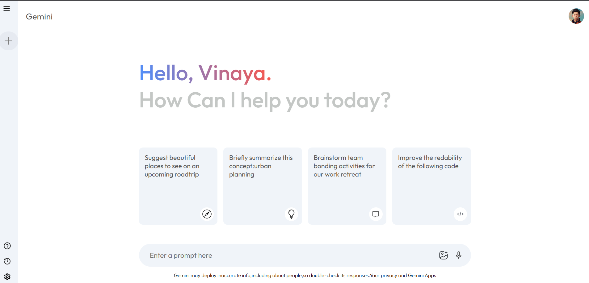
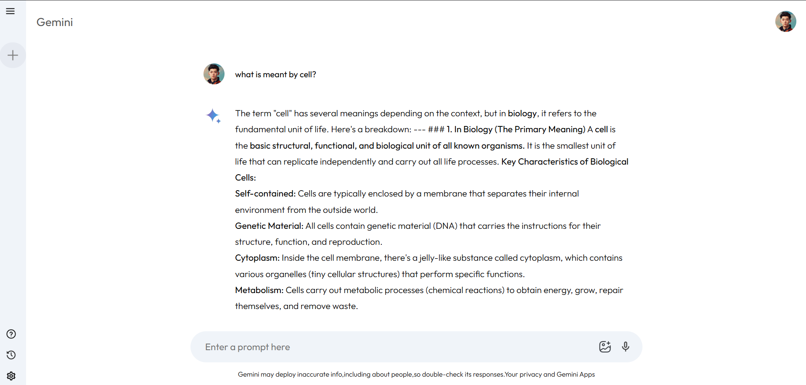

# Gemini AI Clone

A React-based AI chat application that integrates the Google Gemini API to generate real-time conversational responses through a clean and responsive user interface.


## Table of Contents

- [Overview](#overview)
- [Features](#features)
- [Tech Stack](#tech-stack)
- [Project Structure](#project-structure)
- [Installation](#installation)
- [Environment Variables](#environment-variables)
- [Running the Project](#running-the-project)
- [How It Works](#how-it-works)
- [Screenshots](#screenshots)
- [Future Improvements](#future-improvements)
- [Author](#author)

## Overview

This project is a single-page AI chat experience built with React and Vite. It allows users to type prompts, send them to the Gemini API, and view AI-generated responses in a chat-style layout with a sidebar and recent prompt history.

## Features

- Chat-style interface with a sidebar and main conversation area
- Prompt input field for sending new requests
- Starter suggestion cards on the home screen
- Loading indicator while the AI response is being generated
- Recent prompts list that can be reopened from the sidebar
- New chat action to reset the current conversation
- Formatted response rendering with bold text and line breaks

## Tech Stack

### Frontend
- React
- Vite
- JavaScript (JSX and CSS)

### APIs
- Google Gemini API via the Google GenAI SDK

### Libraries
- Google GenAI SDK (@google/genai)

### State Management
- React Context API

### Styling
- Custom CSS

## Project Structure

```text
gemini-ai/
├── public/
│   ├── favicon.svg
│   └── icons.svg
├── src/
│   ├── App.jsx
│   ├── main.jsx
│   ├── index.css
│   ├── assets/
│   ├── components/
│   │   ├── Main/
│   │   └── Sidebar/
│   ├── config/
│   │   └── gemini.js
│   └── context/
│       └── Context.jsx
├── package.json
├── vite.config.js
└── README.md
```

## Installation

1. Clone the repository:
   ```bash
   git clone https://github.com/Vinaya-Nikam/Gemini_Clone.git
   ```
2. Navigate into the project folder:
   ```bash
   cd gemini-ai
   ```
3. Install dependencies:
   ```bash
   npm install
   ```

## Environment Variables

Create a .env file in the project root and add the following variable:

```env
VITE_GEMINI_API_KEY=your_google_gemini_api_key
```

## Running the Project

Use the following commands from the project root:

```bash
npm run dev
npm run build
npm run lint
npm run preview
```

## How It Works

1. The user enters a prompt in the input field on the main screen.
2. The app stores the input in the shared React context and sends it to the Gemini integration module.
3. The Google Gemini API returns a response, which is processed and displayed in the result area.
4. Recent prompts are stored in the sidebar so the user can reopen them, and the New Chat action resets the current conversation.

## Screenshots

### Home Page



### AI Response



## Future Improvements

- Add persistent chat history across browser refreshes
- Improve error handling for invalid API keys or failed requests
- Add support for richer multi-turn chat experiences

## Author

Name: Vinaya Nikam

GitHub:
https://github.com/Vinaya-Nikam

LinkedIn:
https://www.linkedin.com/in/vinaya-nikam-58b4ba291
